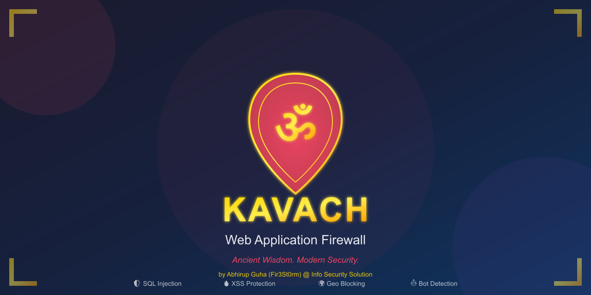

# 🛡️ Kavach WAF

> **Kavach** (Sanskrit: कवच) means *armor* or *protective shield* — A powerful Web Application Firewall for Node.js applications.

[](https://opensource.org/licenses/MIT)
[](https://nodejs.org/)
[]()
[-orange.svg)]()
[]()

**Made by Abhirup Guha A.K.A Fir3St0rm from Info Security Solution**

Kavach is a comprehensive, open-source Web Application Firewall (WAF) inspired by ancient Indian concepts of protection and defense. Just as the *Kavach* (armor) protected warriors in battle, this WAF protects your web applications from modern cyber threats.



## ✨ Features

### 🎯 Core Protection (The Five Shields)

| Shield | Protection Against |
|--------|------------------|
| **Agni** (Fire) | SQL Injection attacks |
| **Vayu** (Wind) | XSS (Cross-Site Scripting) |
| **Prithvi** (Earth) | Path Traversal & LFI |
| **Jal** (Water) | Command Injection |
| **Akash** (Space) | NoSQL Injection, XXE, SSTI |

### 🚀 Advanced Features

- **🤖 Bot Detection** — Identifies and blocks automated scrapers, crawlers, and malicious bots
- **🌍 Geo-Blocking** — Block requests by country (CN, RU, etc.)
- **📊 Real-time Dashboard** — Beautiful web UI with live statistics and charts
- **🔔 Webhook Notifications** — Get instant alerts on Slack, Discord, or custom URLs
- **⚡ Smart Rate Limiting** — Per-IP and per-endpoint rate limiting
- **🧹 Request Sanitization** — Automatic input cleaning and HTML encoding
- **📥 Import/Export** — Backup and restore your entire configuration
- **🔐 CSRF Protection** — Built-in CSRF token validation

## 🚀 Quick Start

### Installation

```bash
# Clone the repository
git clone https://github.com/yourusername/kavach-waf.git
cd kavach-waf

# Install dependencies
npm install

# Start the WAF
npm start
```

### Access Points

| Service | URL | Description |
|---------|-----|-------------|
| **Protected App** | http://localhost:3000 | Your application (shielded) |
| **Dashboard** | http://localhost:3001 | Management UI & analytics |
| **API** | http://localhost:3001/api | REST API for automation |

## 📖 Onboarding Your Web Application

### Option 1: Express Middleware (Recommended)

Add Kavach directly to your existing Express app:

```javascript
const express = require('express');
const { WAFMiddleware } = require('kavach-waf/src/middleware');

const app = express();

// Initialize Kavach
const kavach = new WAFMiddleware({
  logAllRequests: true,
  enableBotDetection: true,
  enableGeoBlocking: true,
  maxRequestSize: 10 * 1024 * 1024 // 10MB
});

// ⚠️ IMPORTANT: Apply Kavach BEFORE your routes
app.use(kavach.middleware());

// Your existing routes
app.get('/', (req, res) => {
  res.send('My protected website!');
});

app.listen(3000, () => {
  console.log('🛡️ Website protected by Kavach on port 3000');
});
```

### Option 2: Reverse Proxy

Use Kavach as a reverse proxy in front of your application:

```javascript
const express = require('express');
const { createProxyMiddleware } = require('http-proxy-middleware');
const { WAFMiddleware } = require('kavach-waf/src/middleware');

const app = express();
const kavach = new WAFMiddleware({ logAllRequests: true });

// Kavach filters requests first
app.use(kavach.middleware());

// Then proxy to your actual app
app.use('/', createProxyMiddleware({
  target: 'http://localhost:8080',  // Your app URL
  changeOrigin: true
}));

app.listen(3000, () => {
  console.log('🛡️ Kavach protecting http://localhost:8080 on port 3000');
});
```

### Option 3: Standalone Mode

Use the built-in server and modify `src/index.js`:

```javascript
// Replace the example routes in src/index.js with:

// Serve your static website
app.use(express.static('path/to/your/website'));

// Or serve a specific file
app.get('/', (req, res) => {
  res.sendFile('/path/to/your/index.html');
});
```

Then run:
```bash
npm start
```

## 🎮 Dashboard Features

The Kavach Dashboard provides complete control over your security:

- **📊 Real-time Statistics** — Live view of requests, blocks, and threats
- **📈 Traffic Charts** — Visualize traffic patterns with Chart.js
- **🛡️ Rule Management** — Enable/disable, create, edit security rules
- **🌍 Geo Management** — Block/allow countries with a click
- **🤖 Bot Control** — Manage bot detection settings
- **🔔 Webhooks** — Configure notification endpoints
- **📋 Request Logs** — Detailed logs with filtering and export
- **🧪 Rule Testing** — Test requests without affecting production

## 🧪 Testing Attacks

Try these URLs to see Kavach in action:

```bash
# SQL Injection (will be blocked)
curl "http://localhost:3000/api/search?q=' OR '1'='1"

# XSS Attack (will be blocked)
curl -X POST http://localhost:3000/api/comment \
  -H "Content-Type: application/json" \
  -d '{"comment": "<script>alert(1)</script>"}'

# Path Traversal (will be blocked)
curl "http://localhost:3000/api/file?file=../../../etc/passwd"

# Command Injection (will be blocked)
curl "http://localhost:3000/api/ping?host=127.0.0.1;cat /etc/passwd"
```

## 📚 API Reference

### Statistics
- `GET /api/stats` — Get WAF statistics
- `GET /api/stats/realtime` — Get real-time stats

### Rules Management
- `GET /api/rules` — List all rules
- `POST /api/rules` — Create new rule
- `PUT /api/rules/:id` — Update rule
- `DELETE /api/rules/:id` — Delete rule
- `POST /api/rules/:id/toggle` — Toggle rule status

### IP Management
- `GET /api/ips/blocked` — List blocked IPs
- `POST /api/ips/block` — Block an IP
- `POST /api/ips/unblock` — Unblock an IP
- `POST /api/ips/whitelist` — Whitelist an IP

### Geo-Blocking
- `GET /api/countries/blocked` — List blocked countries
- `POST /api/countries/block` — Block a country
- `POST /api/countries/unblock` — Unblock a country

### Webhooks
- `GET /api/webhooks` — List webhooks
- `POST /api/webhooks` — Add webhook
- `POST /api/webhooks/:id/test` — Test webhook

### Configuration
- `GET /api/export` — Export configuration
- `POST /api/import` — Import configuration
- `GET /api/config` — Get configuration
- `PUT /api/config` — Update configuration

## 🏗️ Architecture

```
┌─────────────────┐     ┌──────────────┐     ┌─────────────────┐
│   Client        │────▶│  Kavach WAF  │────▶│  Your App       │
│   (Browser)     │     │  (Port 3000) │     │  (Protected)    │
└─────────────────┘     └──────────────┘     └─────────────────┘
         │
         │              ┌─────────────────┐
         └─────────────▶│  Dashboard UI   │
                        │  (Port 3001)    │
                        └─────────────────┘
```

## 🧘 Philosophy

> *"Just as the Kavach (armor) protects the warrior in battle, 
>  this WAF protects your application in the digital realm."*

Kavach follows the ancient Indian principle of **"Dharma"** (duty/righteousness) in security:
- **Protection** without compromising usability
- **Transparency** in all security decisions
- **Flexibility** to adapt to your needs

## 🤝 Contributing

Contributions are welcome! Please read our [Contributing Guide](CONTRIBUTING.md) for details.

## 👨‍💻 Author

**Abhirup Guha** A.K.A **Fir3St0rm**

[](https://github.com/Fir3St0rm)
[](https://)

> *"Security is not a product, but a process. Inspired by ancient wisdom, built for modern threats."*
> — Fir3St0rm

## 📜 License

MIT License © 2024 Abhirup Guha (Fir3St0rm) - Info Security Solution

---

<p align="center">
  <strong>🛡️ Protect your digital realm with Kavach</strong><br>
  <em>From the ancient wisdom of the Vedas to modern cybersecurity</em><br>
  <sub>Made with ❤️ by <strong>Abhirup Guha</strong> (Fir3St0rm) @ Info Security Solution</sub>
</p>
